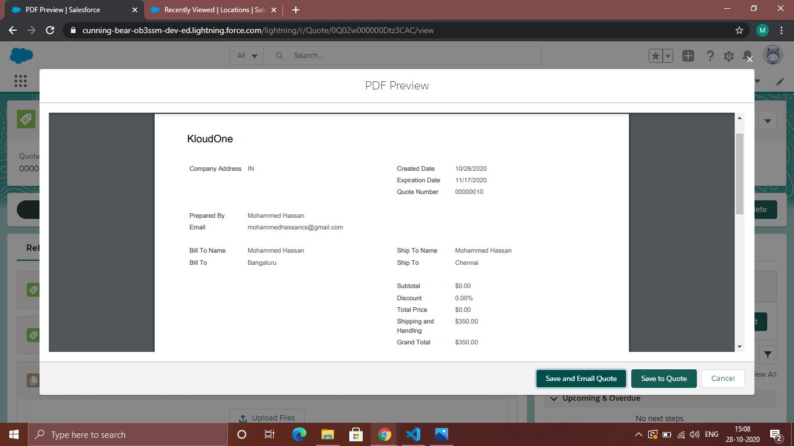
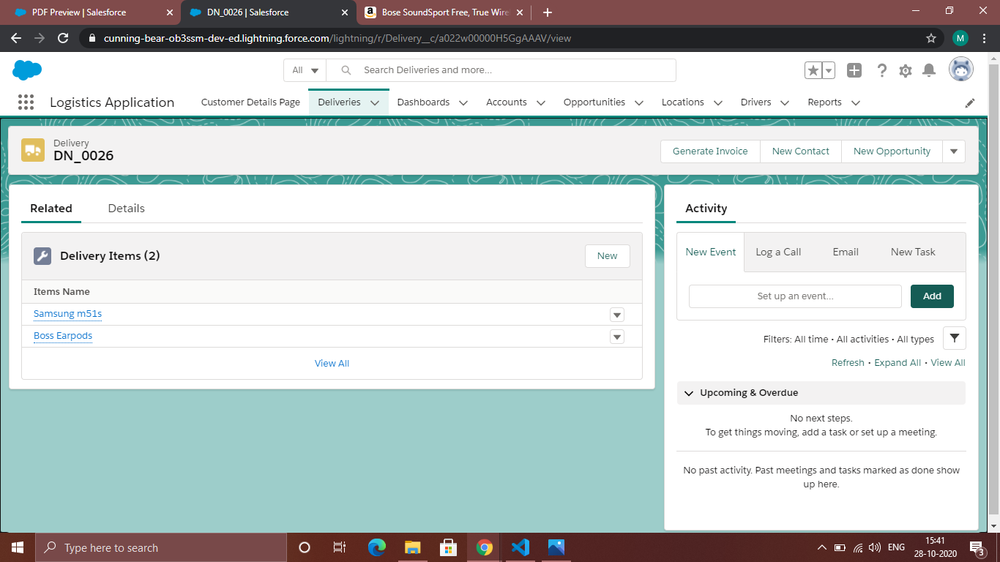

# LogisticsApplication
Hi,

I Created a Home Page to get a Customer Details by using LWC.

Then i created a List of Locations where our company is available to Deliver.

These are the Details in every Location, where i am giving during creation.

Using Trigger am creating Quotation, this will done automatically after a creation of every customer details. And this is how quotation looks like,

I created a List of Driver's with Driver's Info and these are the drivers are working in our company.

And Every Driver has their information within.

Then, i created Delivery where am assigning the driver for particular customer to deliver the product and after creation of delivery iam adding the product for that customer.

These are the Items where that customer is purchasing.

And these are the details of Delivery_item

I create a Action Button to Generate Invoice with Driver charges. And the Invoice Page is developed using VisualForce Page.

Then i created the Dashboard with Priority Based and Delivery Status Based.

I created a Trigger to make our work automate, which means whenever I updates the Delivery Status to the next stage then it automatically sends a mail to the customer's mail Id. To Update the customer every time.

I updated the Delivery Status from Ready To Pick to Dispatched.

Then, this is the mail a customer will receive.

